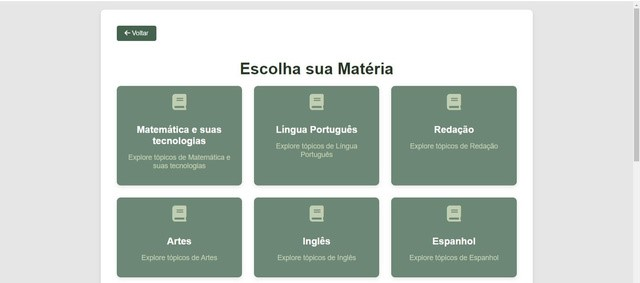

# EnemPlatd - Plataforma digital para Enem📌

O estudo explora o desenvolvimento de uma plataforma digital para apoiar 
estudantes na preparação para o Exame Nacional do Ensino Médio (ENEM). 
O nosso objetivo tem como foco auxiliar os estudantes através de uma plataforma digital.

 

## Tela 🖥

 

## Como executar o projeto ⚙
### *Versões*
- **PHP** (version 8.1.25)
- **XAMPP** (version  8.1.25)
- **HTML** (version HTML5)
- **CSS** (version CSS3)
- **JAVASCRIPT** (version 1.8)

### *Inicializando o projeto*
1. Inicie o **XAMMP** e ative o servidor Apache e o banco de dados **MySQL**. 
2. **Importe o banco de dados:** 
   ▪ O arquivo do banco de dados pode ser encontrado no repositório. 
   ▪ Utilize o phpMyAdmin para realizar a importação. 
3. Mova o repositório para a pasta **htdocs**: 
   ▪ Coloque na pasta **c:\xampp\htdocs** . 
4. Abra o navegador e acesse o projeto: 
   ▪ Digite **http://localhost/enemplatd_bd** no navegador.

### 🚀*Criando uma conta*
Para acessar todas as funcionalidades do site, é necessário estar logado. Se ainda não possui uma conta:

1. Clique no botão "Cadastrar-se". 
2. Selecione a opção "Criar Conta". 
3. Preencha as informações solicitadas de forma simples e rápida. 

Depois de fazer login, você poderá aproveitar todos os recursos disponíveis no site. 

Se desejar acessar a área do administrador, utilize: 
Login - admin@gmail.com 
Senha - 1234

## Autores 🤝

- Ana Clara Tavares Leite 
- Leticia Aparecida Lucena Morais 
- Rafaela Gatera Tudela

## Como citar o projeto
ENEMPLATD. Plataforma digital de auxílio para o ENEM. 2024. Disponível em: <https://github.com/leticiamorais2006/EnemPlatd>. Acesso em: 27 nov. 2024.

## Apendice🔗
[Apêndice🗂️](APÊNDICE.docx)
